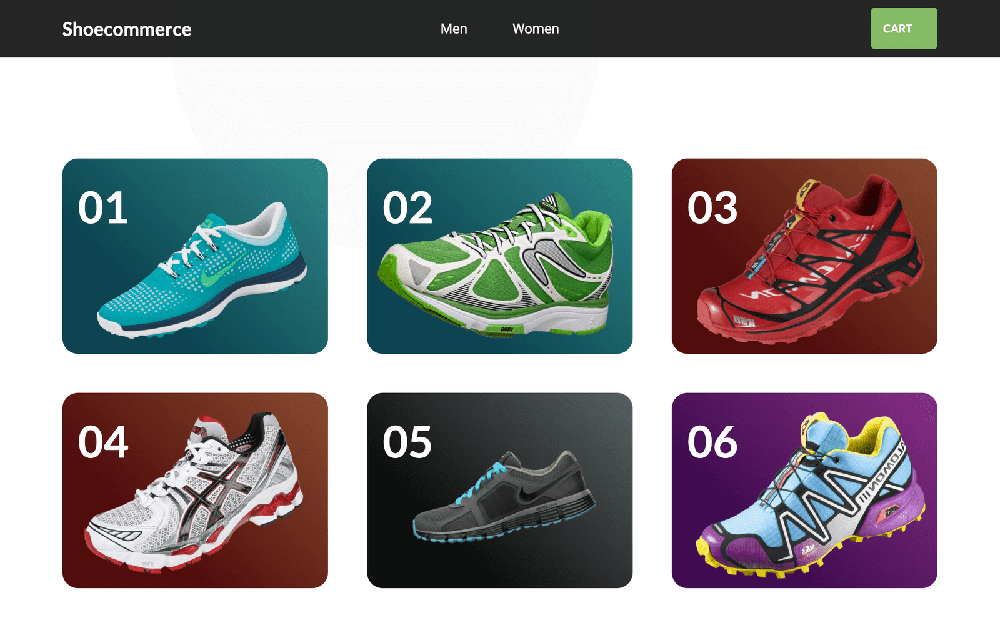

# Shoecommerce

> An ecommerce site created with Gatsby (React) and Snipcart

## Table of contents

- [General info](#general-info)
- [Screenshots](#screenshots)
- [Technologies](#technologies)
- [Setup](#setup)
- [Features](#features)
- [Status](#status)
- [Inspiration](#inspiration)
- [Contact](#contact)

## General info

I created this because with COVID out in the world a lot of people are moving to ecommerce this is one of many solutions.

## Screenshots



## Technologies

- HTML
- CSS
- Javascript
- React
- Gatsby
- Snipcart

## Setup

```
npm install
npm run develop
```

## Features

List of features ready and TODOs for future development

- Responsive
- Data fetched from a CMS
- Ecommerce solution with a shopping cart
- Product pages built with a custom template

## Status

Project is: _finished_

## Contact

Created by [Johnathan Brown](https://www.johnathanbrown.me) - feel free to contact me!
